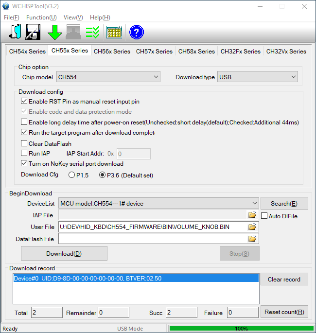

## Compiling new firmware

This is done in Linux. If you are a Windows user, WSL (Windows Subsystem for Linux) is the easiest way to get a Linux environment up and running. Instructions are available [here]( https://docs.microsoft.com/en-us/windows/wsl/install).

#### Install SDCC

Once you have Linux installed, you'll need to install [SDCC](http://sdcc.sourceforge.net/) (the Small Device C Compiler). Open up a bash shell and enter the following commands:

```
sudo apt update
sudo apt install sdcc
sudo apt install build-essential
```

#### Clone the source code

Enter these commands to clone the source code

```
$ cd ~
$ mkdir tiny
$ cd tiny
$ git clone https://github.com/cskilbeck/volume_knob
```

You should now have a folder called `tiny/volume_knob` in your home folder

#### Build the firmware

To build the firmware, enter these commands

```
$ cd ~/tiny/volume_knob/ch554_firmware
$ make
```

If all goes well, you should see output similar to this

```
$ make
src/main.c
src/hid.c
lib/debug.c
volume_knob.ihx
volume_knob.bin
volume_knob.hex
packihx: read 90 lines, wrote 157: OK.
```

The firmware binary file will be in `~/tiny/volume_knob/ch554_firmware/bin/volume_knob.bin`

You will need to access the binary file location from Windows. Either copy it to `//mnt/c/temp` (for example) or find it in the Windows Explorer via e.g. `\\wsl$\Ubuntu\home\chs\tiny\volume_knob\ch554_firmware\bin`

## Flashing the firmware

This is done in Windows. The vendor supplied tool [WCHISP](http://www.wch.cn/downloads/WCHISPTool_Setup_exe.html) is not available for other operatings systems, as far as I can tell. There are some open source alternatives which might work for Linux/MacOS such as [CH552Tool](https://github.com/MarsTechHAN/ch552tool) but I haven't tested any of them.

#### Update Firmware

1) Install and run WCHISPTool
1) Set up the options as per this image 
1) These options are the ones that matter:
    - The 2nd tab (***CH55x Series***) is selected
    - ***Run the target program after download complete*** is checked
    - ***Download Cfg*** is set to **P3.6**
    - ***Download type*** is set to **USB**
1) Press and hold down the volume knob for 10 seconds. You should see the device appear in the DeviceList field. If it doesn't show up, try these steps:
    - Unplug it, plug it back in and hold the knob down for 10 seconds again
    - Plug it directly into your computer, rather than through a USB Hub, retry holding knob down for 10 seconds
    - Contact me, there is a more hard core method for getting it into update mode but it's fiddly and involves opening the case
1) Click the Folder Browse icon to the right of the User File field
1) In the File Open Dialog, select the `volume_knob.bin` file you built previously
1) Click the Download button (the 'D' shortcut doesn't work for me)
1) Check the log messages in the Download record section. If successful, the new firmware is now installed